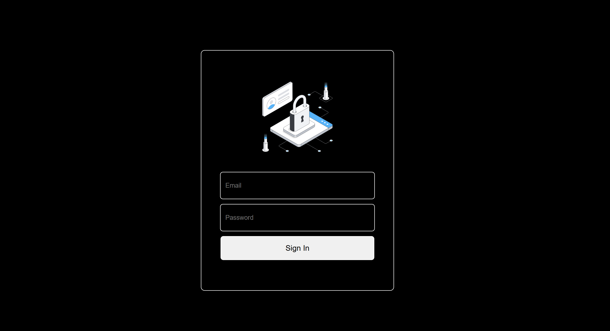

# 🚪 Login Page - HTML & CSS

A clean and minimal login page built using HTML and CSS. This project demonstrates basic layout structuring with Flexbox, transparent input styling, and responsive design.

## 🔥 Features

- Dark mode background
- Centered login card using Flexbox
- Transparent input boxes
- Custom-styled buttons
- Fully responsive layout

## 📁 File Structure

```
.
├── index.html        # HTML structure
├── style.css         # Stylesheet
├── access.png        # Optional logo or avatar image
└── README.md         # This file
```

## 🧪 How to Run

1. Clone the repository or download the files.
2. Open `index.html` in any browser.
3. Customize the design by editing `style.css`.

## 🛠 Technologies Used

- HTML5
- CSS3 (Flexbox)

## 📷 Preview



## 💡 Customization Tips

- Replace `access.png` with your own logo or image.
- Modify colors and layout in `style.css`.
- Add JavaScript for password visibility toggles or form validation.
